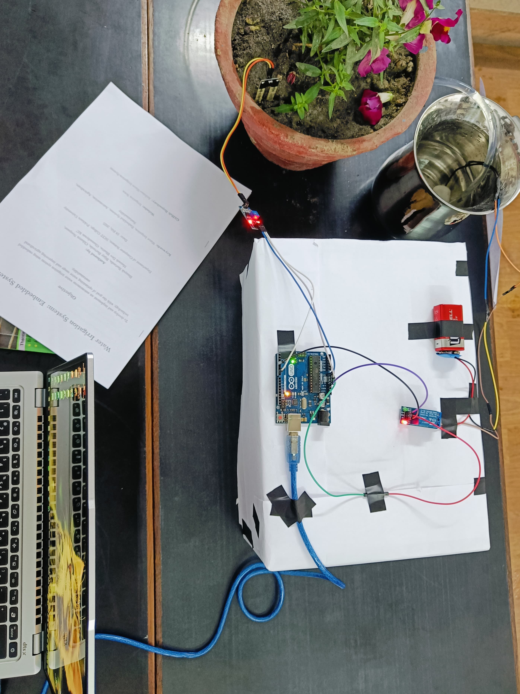
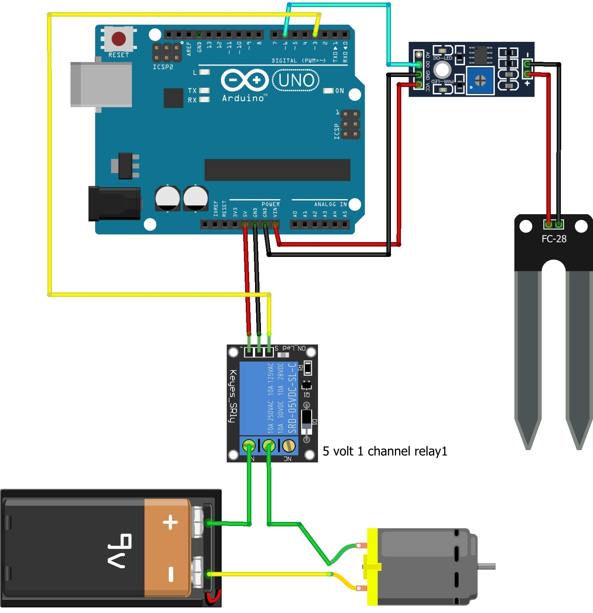
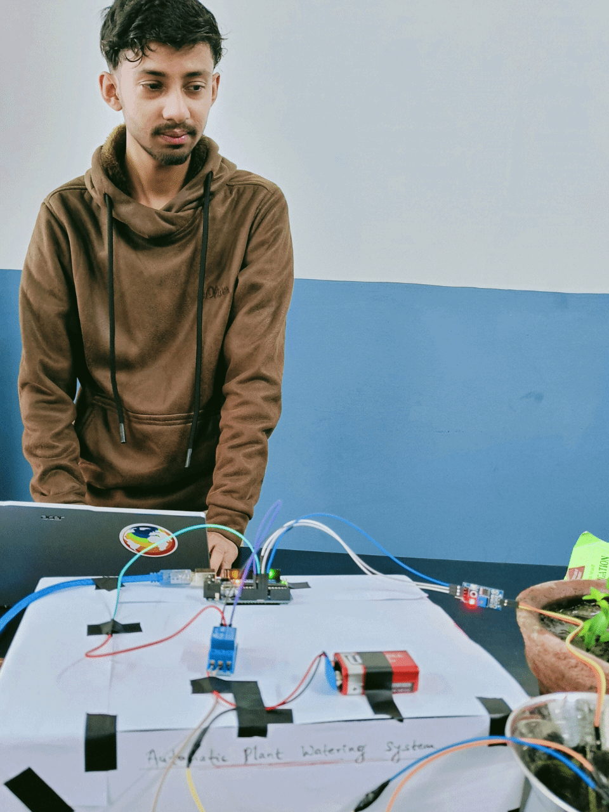

# Autonomous Water Irrigation System using Embedded Systems

  
*An IoT-enabled solution for sustainable agriculture*

---

## 📖 Project Description
This embedded systems project automates irrigation by monitoring soil moisture levels in real-time, activating water pumps only when necessary. Designed for precision agriculture, it reduces water waste by up to **35%** compared to traditional methods.

---

## ✨ Key Features
- 🌱 **Real-time soil moisture monitoring**  
  Continuously tracks the soil's moisture levels, providing up-to-date information to optimize irrigation and prevent overwatering.

- ⚡ **Automated pump control via relay**  
  Automatically activates or deactivates the water pump based on the moisture level, ensuring efficient irrigation without manual intervention.

- 📊 **Serial monitor data logging**  
  Logs moisture data and system status to the serial monitor for real-time viewing and troubleshooting, making it easier to monitor the system's performance.

- 🔋 **Low-power operation (9V battery compatible)**  
  Designed to run on low power, making it efficient for long-term use with a 9V battery, perfect for off-grid applications.

- 🛠️ **Adjustable moisture threshold**  
  Allows users to set their preferred soil moisture level at which the irrigation system will trigger, giving full control over when watering happens.

---
## 🎯 *Objectives*

The primary aim of this project is to design a *Smart Irrigation System* that can effectively monitor soil moisture and ambient humidity, automatically triggering irrigation when needed. This project focuses on:

- **Water Conservation**: Minimize water wastage by activating irrigation based on real-time moisture levels.
- **Optimized Plant Growth**: Ensure plants receive the right amount of water for healthy growth, avoiding over-watering.
- **Reduced Manual Labor**: Automates irrigation, providing a reliable and consistent solution for plant care.

---

## 📚 *Learning Outcomes*

Through this project, you will:

- Gain hands-on experience with microcontrollers, such as the Arduino, and sensor integration.
- Develop problem-solving skills related to automating irrigation and plant care.
- Learn about **sustainable agricultural practices** and **water conservation** techniques.

---

## 💡 *Applications*

This system can be used in a variety of contexts:

- **Agriculture**: Automates irrigation for farms to conserve water and improve crop yields.
- **Gardening**: Ideal for home gardens, greenhouses, or indoor plants.
- **Public Spaces**: Implement in parks or landscaping areas to optimize watering and reduce water waste.

---

## 💸 *Cost Considerations*

The approximate cost of the hardware is **$70**. There are optional upgrades available, such as:

- **Mobile App Integration** or **Weather APIs**: These upgrades could increase the cost by **$20–$30**.

---

## 🛠️ Hardware Components
| Component | Quantity | Purpose |
|-----------|----------|---------|
| Arduino Uno | 1 | System brain |
| Capacitive Soil Moisture Sensor | 1 | Moisture measurement |
| 5V Relay Module | 1 | Pump control |
| DC Water Pump | 1 | Irrigation actuator |
| Breadboard | 1 | Circuit assembly |
| Jumper Wires | 10+ | Connections |

---

## 🚀 Installation & Setup
1. Clone repository:
   ```bash
   git clone https://github.com/binayakbartaula11/Arduino-Water-Irrigation-System.git
   ```
2. Connect components as per circuit diagram
- Ensure that the sensor, relay, and pump are correctly connected to the specified Arduino pins.
### 🔌 Circuit Diagram:

3. Upload code to Arduino:
```cpp
   // Variable to store the state of the soil sensor (HIGH or LOW)
int water;

void setup() {
  // Set pin 3 as OUTPUT to control the relay (water supply)
  pinMode(3, OUTPUT);  
  
  // Set pin 6 as INPUT to read data from the soil sensor
  pinMode(6, INPUT);   
}

void loop() {
  // Read the state of the soil sensor (HIGH if moist, LOW if dry)
  water = digitalRead(6);  

  // If the soil is moist, cut off the water supply
  if (water == HIGH) {  
    digitalWrite(3, LOW);
  } 
  // If the soil is dry, activate the water supply
  else {  
    digitalWrite(3, HIGH);
  }

  // Wait for 400 milliseconds before the next reading to prevent rapid toggling
  delay(400);  
}
```

---

## 🌧️ System Operation
1. Continuous moisture monitoring (1Hz sampling rate)
2. Pump activation when moisture < 500 (adjustable threshold)
3. Automatic shutoff when optimal moisture reached
4. Real-time status updates via serial monitor

---

## 🛠️ Troubleshooting

Having issues? Check out these common problems and solutions:

### Sensor Not Responding:
- Verify that the sensor is connected to the correct pin.
- Ensure the sensor's power supply is stable.
- Check for loose jumper wires.

### Relay Malfunction:
- Confirm that the relay module is receiving proper 5V power.
- Test the relay independently with an LED or multimeter.
- Ensure the Arduino pin (pin 3) is correctly defined as OUTPUT.

### Pump Not Operating:
- Check the pump’s power supply and wiring.
- Make sure the relay's contacts are not damaged.
- Test the pump with an independent power source.

### Code Upload Issues:
- Ensure the correct board and port are selected in the Arduino IDE.
- Restart the IDE or computer if persistent upload errors occur.

---

---

## 👤 Presentation GIF

This GIF captures me proudly showcasing the completed project, reflecting my personal contribution and the effort put into bringing it to life.



---

## 🎥 Demo GIF

Check out this GIF showing the project in action and demonstrating its core features.


---

---

## 📈 Performance Metrics
| Parameter          | Value                          |
|--------------------|--------------------------------|
| Response Time      | <1 second                      |
| Water Savings      | 30-40%                         |
| Power Consumption  | 0.8W (idle) / 5W (active)      |
| Sensor Accuracy    | ±3% RH                         |

---

## 🌟 Future Enhancements
- ☁️ **IoT integration for cloud monitoring**  
  Integrating the system with the Internet of Things (IoT) will allow users to monitor and control the irrigation system remotely via cloud platforms. This enables real-time data tracking, notifications, and adjustments, enhancing convenience and accessibility.

- 🤖 **Machine learning-based predictive irrigation**  
  By incorporating machine learning algorithms, the system can learn from historical data (e.g., soil moisture, weather patterns) to predict optimal irrigation times. This will help improve efficiency and reduce water waste by automating smarter irrigation decisions.

- 🌞 **Solar power integration**  
  Adding solar panels to power the system will make it more sustainable and energy-efficient. This enhancement will reduce the reliance on traditional power sources, making the system suitable for remote or off-grid locations.

- 🌍 **Multi-zone irrigation support**  
  Supporting multiple irrigation zones will allow the system to independently water different sections of a garden or farm. Each zone could have its own sensor, allowing for tailored watering schedules based on specific plant needs, improving overall water efficiency.

---

## 📄 License

This project is licensed under the [MIT License](https://opensource.org/licenses/MIT).

---

## 📧 *Contact Information*

For inquiries, suggestions, or feedback, feel free to reach out:

**Binayak Bartaula**  
Email: [binayak.221211@ncit.edu.np](mailto:binayak.221211@ncit.edu.np)  
Computer Science Department, NCIT College, Pokhara University

---

## 🔗 *Links*

- *Project Repository*: [View on GitHub](https://github.com/binayakbartaula11/Arduino-Water-Irrigation-System/blob/main/Water-Irrigation-System/src/Water-Irrigation-System.ino)
- *Documentation*: [Download Documentation](https://github.com/binayakbartaula11/Arduino-Water-Irrigation-System/Report_On_Water_Irrigation_System.pdf)
